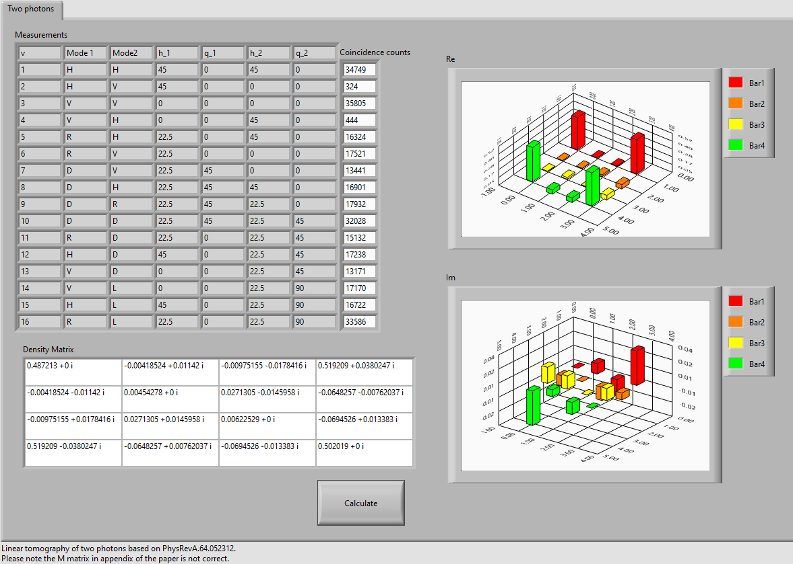
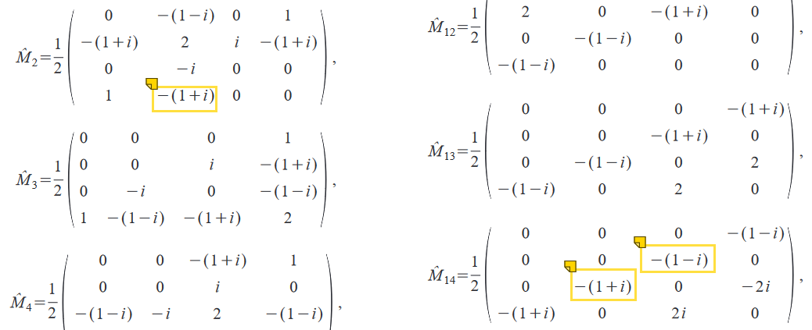

# LabView Photon Tomography
This is a simple linear tomography tool for polarization of photon pairs in LabView.

## Usage

A linear tomography requires 16 times of measurements on both photons. You can check the recommended wave plate setup in the table, and fill in the coincidence counts in the last column. For the limitation of linear tomography, the density matrix may not lead to a physical reasonable state.

## More about photon tomography
The theory and example is illustrated in paper [Measurement of qubits](https://journals.aps.org/pra/abstract/10.1103/PhysRevA.64.052312).
Please note there are some items of $\hat{M}$ in APPENDIX B is not correct.
From left to right, the true value: $-(1-i), (1+1), (1-i)$

Find more about quantum tomography at website of  [Kwiat Quantum Information Group](http://research.physics.illinois.edu/QI/Photonics/Tomography/).
They have a much more detailed implementation in matlab and python with an online interface.